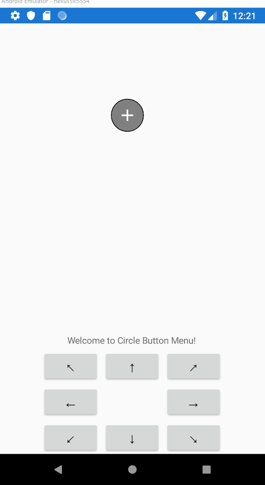

# Circle Button Menu for Xamarin.Forms
A Circle Button Menu Control for Xamarin.Forms

## Setup

* Available on NuGet: [](https://www.nuget.org/packages/CircleButtonMenu)
* Install into your PCL/.NET Standard and Client Projects

## Build

* [](https://ci.appveyor.com/project/ahoefling/circlebuttonmenu)
* CI NuGet Feed: [https://ci.appveyor.com/nuget/CircleButtonMenu](https://ci.appveyor.com/nuget/CircleButtonMenu)
    
### Platform Support
CircleButtonMenu is available for use in the following supported platforms.

| Platform         | Supported | Version     |
|------------------|-----------|-------------|
| Xamarin.Android  | Yes       | API 23 +    |
| Xamarin.iOS      | Yes       | iOS 10 +    |




## Usage ##

#### iOS and Android####
Initialize the renderer in the AppDelegate (iOS) and MainActivity (Android)

```c#
Xamarin.Forms.Init();
CircleButtonMenuRenderer.Init();
```

### XAML: ####
Add the namespace in the xmlns:

```xml
xmlns:controls="clr-namespace:CircleButtonMenu.Abstractions;assembly=CircleButtonMenu.Abstractions"
```

Add the control:

```xml
<controls:CircleButtonMenu FillColor="Black"
                           StrokeColor="Red"
                           OpenImageSource="plus"
                           CloseImageSource="minus"
                           Direction="DownLeft"
                           Flow="Expand"
                           ItemsSource="{Binding Controls}"
                           IndexSelected="{Binding ControlSelected}" />
```

View Model:
```c#
public IEnumerable<string> Controls = new [] { "resource1", "resource2" };
public ICommand ControlSelected = new Command(() => /* do something */ );
```

## Bindable Properties

| Property          | Description                                            | Default Value              | Version |
|-------------------|--------------------------------------------------------|----------------------------|---------|
| FillColor         | Gets or Sets the fill color for the circle.            | `Color.Black`              | v1.0.9  |
| StrokeColor       | Gets or Sets the circle border color                   | `Color.Black`              | v1.0.9  |
| OpenImageSource   | Gets or Sets the open menu `ImageSource`               | `null`                     | v1.0.9  |
| CloseImageSource  | Gets or Sets the close menu `ImageSource`              | `null`                     | v1.0.9  |
| ItemsSource       | Gets or Sets the menu buttons                          | `null`                     | v1.0.9  |
| IndexSelected     | Gets or Sets the command for IndexSelected             | `null`                     | v1.0.9  |
| Direction         | Gets or Sets the direction the controls will flyout in | `Up`                       | Preview |
| Flow              | Gets or Sets the flow of the controls, ex: Snake       | `Expand`                   | Preview |

## Created By: [@Andrew_Hoefling](https://twitter.com/andrew_hoefling)

* Twitter: [@Andrew_Hoefling](https://twitter.com/andrew_hoefling)
* Blog: [andrewhoefling.com](http://www.andrewhoefling.com)

### License

The MIT License (MIT) see License File
